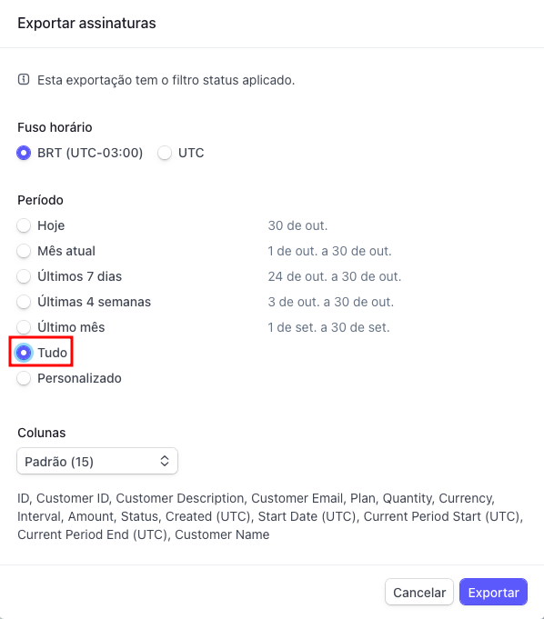
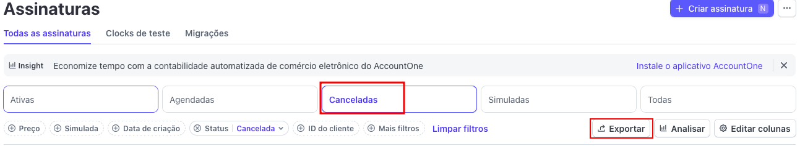

# Stripe

Utilizamos o [Stripe](https://stripe.com/br) como plataforma de gestão de pagamentos e associados da APyB. A Stripe é uma plataforma globalmente reconhecida e utilizada por diversas organizações sem fins lucrativos ao redor do mundo.

Abaixo você encontrará informações sobre como gerenciar e utilizar a Stripe no contexto da APyB.

## Como gerar lista de associados ativos?

No [dashboard da Stripe](https://dashboard.stripe.com), acesse **Assinaturas** (Subscriptions) e utilize os filtros para selecionar apenas os **associados ativos**.

Lembre-se de selecionar **todo o período** desejado antes de exportar. Você pode exportar essa lista em formato CSV para análise ou integração com outros sistemas.

Com o csv em mãos, você pode abrir em um editor de planilhas (Excel, Google Sheets, LibreOffice Calc, etc) e consultar os dados como for necessário. Por exemplo, você consegue saber quantas pessoas associadas efetivas temos atualmente, filtrando pela coluna `Plan` (Plano) e contando as linhas que possuem o valor `price_1Pa0m7P5zaoo6rIQBDr6J3jR`.

## Como gerar lista de associados inadimplentes?

Gerar a lista de associados inadimplentes é semelhante ao processo de geração da lista de associados ativos. No [dashboard da Stripe](https://dashboard.stripe.com), acesse **Assinaturas** (Subscriptions) e utilize os filtros para selecionar apenas os associados com status **Canceladas**: 

Para exportar, siga o mesmo processo descrito na seção anterior. Com o CSV em mãos, você pode abrir em um editor de planilhas e analisar os dados conforme necessário.

## Como editar página de pagamento?

Você consegue editar os tipos de planos e preços acessando o [dashboard da Stripe](https://dashboard.stripe.com) e navegando até a seção **Catálogo de produtos**. Lá, você pode criar novos planos, editar preços existentes e configurar detalhes adicionais conforme necessário.

Agora caso você deseje atualizar a página de pagamento hospedada pela Stripe (Stripe Hosted Checkout Page), você pode fazer isso acessando a seção **Catálogo de produtos -> Tabelas de preços** (Products -> Prices) e clicando no catálogo de preços que deseja editar. Na página de detalhes do preço, você encontrará a opção para editar a página de checkout hospedada.
